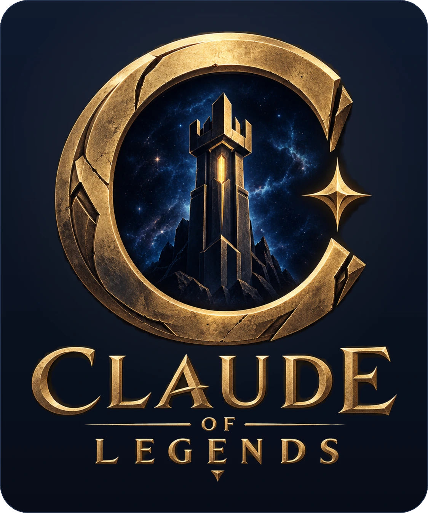

<div align="center">



**A 5v5 MOBA born in a 48 hour vibe coding sprint: three lanes, ten champions, free in your browser right now.**

**Play now: https://claudeoflegends.com/**

[](https://github.com/killian01/claude-of-legends/actions/workflows/ci.yml)
[](https://www.typescriptlang.org/)
[](https://threejs.org/)
[](https://vite.dev/)
[](https://vitest.dev/)
[](LICENSE)
[](package.json)
[](CONTRIBUTING.md)
[](https://discord.gg/uURYY5qYJE)

[Play now](https://claudeoflegends.com/) · [Discord](https://discord.gg/uURYY5qYJE) · [Quick start](#quick-start) · [How to play](#how-to-play) · [Train a bot](#every-bot-is-a-policy-train-one) · [Make a champion](#make-a-champion-in-the-game-or-in-the-repo) · [Contributing](CONTRIBUTING.md)

**Want to build something here?** The eleventh champion is one new file and
three table entries: [docs/adding-a-champion.md](docs/adding-a-champion.md).
A smarter bot is a playbook, no engine code at all. Small and self-contained:
[`good first issue`](../../labels/good%20first%20issue).


</div>

## What this is

A complete mini MOBA you can play right now: three lanes, ten champions with
full kits, jungle camps, a neutral objective, fog of war, items, skins, a
ladder, a Forge where you build a champion of your own, and an authoritative
server for online play. No install. Online play
needs a free account; the practice match against bots does not. An account is
a name and a password, or one click on Continue with Discord: that button
creates an account from a Discord identity and signs it back in (ADR 0009).

The whole game was vibe coded with Claude in a 48 hour sprint, then polished
in the open; the commit history is the real build log, kept intact. It runs
on the architecture proven by
[world-of-claudecraft](https://github.com/levy-street/world-of-claudecraft):
one deterministic TypeScript simulation core that runs identically in the
browser, on the server, and headless, with every non-human participant
driven by a single `Policy` abstraction.


## How it was built

The first commit is dated 26 August 2026. A playable 5v5 came out of the
first 48 hours (`docs/plan-48h.md`); the table below is where eleven days in
the open left it, written one commit at a time by one maintainer and Claude
Code in a terminal.

| | |
|---|---|
| Commits | 380 |
| TypeScript, tests excluded | 66,489 lines |
| Tests | 1,229 cases in 167 files, 23,330 lines |
| Decisions written down | 18 ADRs in `docs/adr/` |
| Champions | 10, every one with a full kit |

*Counted on 6 September 2026; the repository is the current version.*

The last two rows are the ones that matter. The test suite is larger than
the simulation core it covers, 23,330 lines against 14,892, and every
decision that could have gone another way has a page in `docs/adr/` saying
what was chosen and what was given up for it. That is not a tax on the
speed. A model writes code fast enough that the bottleneck moves to knowing
whether the code is right, so the tests and the decision records are what
the speed gets spent on.

Three constraints did the rest of the work. The simulation is deterministic
on a fixed 20 Hz tick with every random number drawn from a seeded `Rng`, so
a bug is a seed and a replay instead of a story
(`tests/determinism.test.ts`). That same core runs in the browser, on the
server and headless, with no second implementation to drift out of step
(ADR 0001). And every non-human participant, from a lane bot to a playbook
someone trained in the Academy, is the one `Policy` interface, so the bots
never became a subsystem nobody dared touch (ADR 0002).

The commit history is the real build log and it has been kept intact. To see
what adding to it looks like, `docs/adding-a-champion.md` walks a champion
from empty file to champion select.

## Quick start

Node 22 or newer and pnpm. `nvm use` picks the right one from `.nvmrc`;
22 is not a preference, the server's stores are built on `node:sqlite`.

```
pnpm install
pnpm dev
```

Open http://localhost:5173 and pick "Play offline now": a full 5v5 against
bots, no server needed.

For online play, run the server in a second terminal:

```
pnpm server        # authoritative server on :8787
pnpm dev           # client; /ws is proxied to the server
```

Then "Play online" to queue (empty seats fill with bots on request), or
"Create private lobby" and share the 5-letter code with friends.

Every match is played on the **Star Orchard**, the authored Blender map:
practice, ranked, lobbies and the bots' Arena alike. See
[the map](docs/star-orchard.md).

## How to play

- Right-click: move or attack. A: attack-move. S: stop and hold. B: recall.
- Q W E R: abilities, cast at the cursor (hold for the range preview).
  Level them with Alt+key or by clicking the plus.
- D F: sigils (picked in champion select). P: shop. Tab: scoreboard.
- Enter: chat. G: ping. Esc: menu. Space recenters; screen edges pan.
- Push a lane, take towers, and destroy the enemy Sanctum to win. The
  Pyrefang and the Voidmaul rise on the two corner rings from 4:00 and
  hand whoever slays them a permanent favor and gold for the whole team;
  the Warden at the center, from 12:00, grants the bigger, temporary Boon;
  late in the match each ring's creature returns as its Ascendant, a body
  for a full team whose death hands the Wrath.
- Or field a bot instead of playing by hand (`docs/design/bots.md`). In
  the Academy (the Bots tile on the home, or its bar) write its playbook by talking to the
  coach or editing the plays, spar it against house bots in seconds, then
  queue with it and coach it live: right-click sends it somewhere,
  right-click on an enemy focuses it, the coach bar carries Warden, Ring,
  back, group, hold and free. Deposit it in the Arena and read the Briefing in
  the morning. Three ladders rank the three ways to play: by hand, your
  bot live, your bot in the Arena.

## Every bot is a Policy: train one

Every non-human participant is a deterministic function
`(observation, rng) -> action` behind one versioned contract
(`src/sim/policy.ts`, ADR 0002). The observation is team vision, never
global state, and the decision budget that rate-limits actions applies
identically to humans and bots (ADR 0003): a bot cannot out-click a person,
only out-think one.

That makes the game a reinforcement learning environment as much as a MOBA:

- `pnpm env` runs a full match headless over NDJSON on stdio, one step per
  decision slot, so a trainer outside the repo can drive any seat
  (`headless/README.md`).
- Every house bot, the Laner and the three styles beside it, is a playbook
  (`src/sim/content/playbooks/`, ADR 0013): an ordered list of
  plays run by the interpreter in `src/sim/playbook/`, the same one every
  account's bot runs. A new trigger or behavior there is a contribution
  every bot on the server can use the next morning; a smarter default
  playbook is a self-contained, well-tested pull request.
- A parity test pins that a policy attached in-sim and driven remotely
  produces the identical world.

Community bots, scripted or trained, are the flagship contribution this
project is built around. The other one is a champion.

## Make a champion, in the game or in the repo

Two ways, and they share nothing but the engine underneath.

**In the game: the Forge.** Name it, paint its splash from a prompt, and
write the kit: a passive and four abilities, composed from the same
primitives the roster is built out of, inside a power budget a
deterministic validator enforces. Nothing a player writes ever runs as
code in the sim, because a forged champion is data on the same engine as
the ten (ADR 0010). From the splash you approved, the Forge derives the
model reference, builds the 3D body and its weapon, and then rigs and
animates it on a second, deliberate click, so you see the model before
paying for the motion. Yours plays in the Forge queue, mixed with roster
champions, on that queue's own rating. Everything the server pays a
provider for is priced in embers, from a weekly allowance that rolls
over, and any job that fails refunds exactly what it took (ADR 0017).

**In the repo: a pull request.** One new file,
`src/sim/content/champions/<id>.ts`, three table entries and two tests to
edit. No engine work, no server work, and no art at all, which is the
part nobody believes:

- The **body** is a model you point at, not one you make.
  `public/models/champions/` ships two rigged CC0 characters no champion
  uses yet, `knight.glb` and `goblin.glb`, and any champion's model is
  fair game too.
- The **ability icons** are optional. With none, the procedural painter
  draws all four from the spec, which is what five of the forty icons in
  the game are right now.
- The **splash art** is optional. With none, champion select shows the
  in-engine cinematic render of the model instead: the chain in
  `src/ui/champion_art.ts` resolves the painted illustration first, then
  that render, then the instant procedural figure under both.

So a kit with no assets lands complete and sits on the screen looking
like the rest of the roster. The art is a later pull request, yours or
someone else's. [docs/adding-a-champion.md](docs/adding-a-champion.md)
walks the whole path, and it was written by doing it.

## Production

One process, one port: the server serves the built client and the
WebSocket. Locally:

```
pnpm start         # builds client + server, then runs on :8787
```

With Docker:

```
docker build -t claude-of-legends .
docker run -p 8787:8787 -v loc-data:/app/data claude-of-legends
```

On a public host the game runs behind a proxy that owns TLS and the
public ports. `docker-compose.yml` at the repo root is that deployment:
the container publishes no port, and the front proxy reaches it over a
shared Docker network.

```
docker compose up -d --build
```

The full runbook (the proxy contract, verification, updates, backups,
sizing) is `docs/deploy.md`.

`PORT` overrides the listen port, for the server and for the dev client's
proxy alike, so two checkouts run side by side with one line in each
`.env`. Player identities and the match log
live as JSON files under `data/` (`DATA_DIR` overrides the location);
mount it as a volume or careers reset with the container.

TLS termination (for wss) belongs to whatever proxy sits in front, and
the proxy has to be declared, or the server counts every player as one
machine:

```
TRUST_PROXY=1      # how many proxies sit in front (0, the default: none)
ALLOWED_ORIGINS=   # pages allowed to open a socket besides the one we serve
```

`TRUST_PROXY` is a hop count, not a switch: with 1, the address the
nearest proxy saw is the player, which is what the per-machine socket
limit counts and what `X-Forwarded-Host` is read from. The proxy must
overwrite `X-Forwarded-For` and `X-Real-IP` rather than append to what
the client sent, or a player can pick their own bucket. Leave the count
at 0 when the port faces the internet directly, or a forged header buys
an attacker any address it likes.

The client is served by this same process, so a page from the host in
the request is always allowed and `ALLOWED_ORIGINS` stays empty for a
normal deploy. Name origins in it (comma separated) only when the client
is also served from somewhere else; `*` turns the check off.

## Development

- `pnpm test` (Vitest, includes structural gates), `pnpm check` (strict
  tsc), `pnpm lint` (Biome).
- Repo map and invariants: `CLAUDE.md`. Domain glossary: `CONTEXT.md`.
  Decisions: `docs/adr/`. Design: `docs/design/`. Deferred work:
  `docs/roadmap.md` and `docs/review/`.
- Dev-only pages: `/dev_champions.html` (champion visual gallery, with
  `?portraits` and `?focus=<id>` modes) and `/vfx.html` (spell VFX).

Come say hello on [Discord](https://discord.gg/uURYY5qYJE): that is where
players find each other for a game, and where a kit or a bot gets talked
through before it becomes a pull request.

Contributions are welcome: [CONTRIBUTING.md](CONTRIBUTING.md) has the
setup and the pull request checklist. Issues labeled
[`good first issue`](../../labels/good%20first%20issue) are the best entry
points. Security issues go through [SECURITY.md](SECURITY.md), privately,
never a public issue.

The site loads no analytics service and no advertising pixel, sets one
cookie (your session), and keeps five aggregate numbers a day so that a
quiet launch can be told apart from a front page that loses people.
[PRIVACY.md](PRIVACY.md) is the whole of it, and it points at the file
behind each claim so you can check rather than believe.

All project content, in the game and in the docs, is in English, with
original fantasy naming only (no borrowed IP, see
`docs/adr/0004-original-naming-no-borrowed-ip.md`).

License: MIT for the code (`LICENSE`). Art and model assets are covered by
`CREDITS.md` (CC0 packs by KayKit and Quaternius, plus the three.js basis
transcoder).
