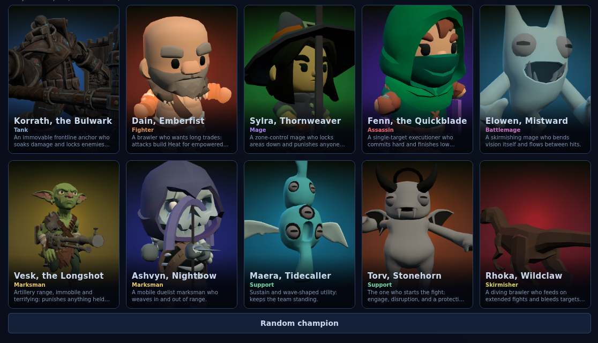

# Adding a champion

A new champion is the contribution this repository most wants, and it is
smaller than it looks: one new file, a line in each of a few tables, and a
number in one test. No 3D modelling, no painting, no server work. This
walks the whole path. (Nisk, the eleventh, came in this way, plus four new
engine primitives its kit wanted; most kits want none.)

Read `CONTRIBUTING.md` first for setup and the pull request checklist, and
skim `CONTEXT.md` for the vocabulary. Everything below assumes `pnpm
install` has run and `pnpm dev` works.

## Design the kit before you write it

A champion is a role plus four abilities plus a passive, and the kit is
where the work is. `docs/design/roster.md` describes the eleven that exist
and `docs/design/kits-v2.md` holds the long form of each. Read a few before
inventing one: they show the level of specificity the kits are written at,
and they tell you what the roster already covers.

Two constraints are not negotiable. First, ADR 0004: every name is original
English, invented for this game. No name, icon, phrase or concept lifted
from another game, and a genuinely new game term goes through `CONTEXT.md`
before it goes into code. Second, the role decides the lane: `HOME_LANES`
in `src/sim/content/champions/index.ts` sends Tank and Fighter top, Mage,
Battlemage and Assassin mid, Marksman and Support bot, and leaves
Skirmisher flex. Pick a role knowing where it will be played.

Open an issue with the kit before building it if you want feedback early.
Issue #11 is the standing one for this.

## The one file you must write

`src/sim/content/champions/<id>.ts`, exporting one `ChampionDef`. Copy the
closest existing champion and work from it; `torv.ts` is a good model for a
melee kit, `elowen.ts` for a ranged one. The shape, defined in
`src/sim/content/champions/index.ts`:

- `id`, lowercase, one word, unique. It keys every table below.
- `name`, the display name, and `blurb`, one line of play-style intent
  shown on the select screen.
- `role`, one of the eight in `ChampionRole`.
- `passive`, a `ChampionPassive` (`src/sim/passive_types.ts`). It hooks the
  engine through `onAttackHit`, `modifyDamage`, `onTick` and `onHealGiven`.
  A passive with no hook is legal and descriptive only, which is what Sylra
  does: her marks live entirely in her ability specs.
- `base` and `growth`, the stat block and its per-level gain. Stay inside
  the spread the existing eleven use; the pacing tests notice an outlier.
- `abilities`, the four keys `Q`, `W`, `E` and `R`. Each is an `AbilityDef`
  with a mana cost, a cooldown, a cast range, a windup and a `spec`. The
  spec is composed from the primitives in `src/sim/combat/`: `dash`,
  `burst`, projectiles, and effect lists like `damage`, `knockup`,
  `knockback`, `taunt`, `slow`. Read what the eleven do before inventing a
  primitive; almost every kit idea composes from what exists.
- `attackSound`, optional, one id from `src/sim/content/sounds.ts`. Left
  out, the model's weapon decides.

Windups are not decoration. Hard crowd control telegraphs itself, and every
existing kit comments why its windup is what it is. Keep that habit.

## The three tables

**The registry**, `src/sim/content/champions/index.ts`: import your export
and add it to the `ALL` array. That is what puts it in `CHAMPIONS`,
`CHAMPION_LIST`, champion select, the roster browser and the bots' fill.

**The skins**, `src/sim/content/skins.ts`: at least three, the first named
`Default` with `body: null` so the team colour shows through, all names
unique. They are palettes, not models: a body colour and an accent colour.
`tests/skins.test.ts` enforces all of that.

**The body**, `src/render/champions/manifest.ts`: an entry in
`CHAMPION_VISUALS` pointing at a GLB with clip, mesh, material and bone
names that exist inside that file. This is the part people assume they
cannot do without an artist, and they can: `public/models/champions/`
ships a rigged CC0 character that no champion uses yet, `knight.glb`
(Nisk took `goblin.glb`). Point at it, or reuse a model another champion
already uses. `tests/champion_visuals.test.ts` reads the
GLB and fails if any name in your entry is not really in the file, because
a renamed node fails silently at runtime.

**The price**, `server/laurels.ts`: every roster champion outside the
starter collection has a price in laurels (ADR 0018), and
`tests/laurels.test.ts` pins both the table and the whole roster's total.

**The planet**, `src/sim/content/royale_tuning.ts` and
`src/sim/content/royale_builds.ts`: the battle royale deals its house seats
from the whole roster, so the champion needs its planet tuning and its loot
build, and the pool changing moves `ROYALE_RULES_VERSION`
(`src/sim/royale/types.ts`). Measure the tuning with
`scripts/royale_report.mjs`.

## The tests you have to edit

`tests/champions.test.ts` opens with `expect(CHAMPION_LIST).toHaveLength(11)`.
That is deliberate: the roster is a fact worth pinning, so adding to it is
a conscious edit. Change the two elevens to twelves. `tests/fixed_match.test.ts`
deals its seats from the sorted ids, so its pinned hash moves too: run it
and pin the new number, saying why. The rest of that file
then walks your kit end to end, casting all four abilities against a live
target, and it will tell you if a spec is malformed.

`tests/forged_twins.ts` is the one nobody expects, so it is worth knowing
before it bites. The Forge's power budget is calibrated against the roster:
"fits the budget" is defined as "as strong as the roster", and that comparison
needs each roster champion expressed in forged shape. Stats and abilities
pass through verbatim, but a code passive has no forged equivalent unless
you say which template it corresponds to, so `TWIN_PASSIVES` maps every id
to one. Miss it and about twenty test files fail to load at all with `no
twin passive mapped for <id>`, which reads like something much worse than
it is.

Add one line keyed by your id. If your passive is descriptive only, copy
Sylra's: `{ template: 'kit_inscribed', params: {}, name: '<passive name>' }`.
A kit that uses what the Forge does not offer (Nisk's charges and pods)
also goes in `OUTSIDE_FORGE` there: it keeps a twin for its bill but stays
out of the calibration set.
If it does something, pick the template in `src/sim/forge/` that matches its
archetype and give it your own numbers, the way Torv's aura maps to
`warding_aura` with its real radius and armor.

## What you can skip

**Painted icons.** Optional. Ship none and the procedural painter draws
your four abilities, which is what the roster did for weeks. If you do have
art, it goes to `public/icons/abilities/<id>_<KEY>.webp` (512px square, run
`scripts/convert_art.mjs` on the PNG the generator hands back) and its id
goes in `src/ui/icon_images.ts`. Both or neither:
`tests/icon_images.test.ts` fails on a listed id with no file and on a file
with no listed id, because each of those fails silently in the client.

**Splash art.** Optional. Missing, champion select falls back to the
in-engine render of the model: `src/ui/champion_art.ts` resolves the
painted illustration in `public/portraits/` first, then that render, then
the instant procedural figure under both. The first ten champions ship an
illustration, so here is the screen with those ten blocked, which is what a
champion with none looks like beside the rest of the roster:



**Bots.** Almost nothing to do. The playbooks in `src/sim/content/playbooks/`
name no champion; they reason about lanes, waves, health and threat. Your
champion is playable by bots the moment it is in the registry, and the
Academy can coach one on it. One line in `src/sim/content/bots/hints.ts`
says what each key is for (a poke, an engage, the escape) and when the
ultimate is worth spending; without it the defaults apply.

**Server, network, protocol.** Nothing to do. A champion is sim content;
the wire carries its id.

## Before the pull request

```bash
pnpm check        # strict tsc
pnpm test         # the whole suite, including the gates above
pnpm lint         # Biome, on the files you touched
```

Then play it: `pnpm dev`, "Play in the browser now", pick it, and use
all four abilities on something. A kit that passes every test and feels
dead is still a kit that needs another pass.

For the record, this guide was written by doing it: an eleventh champion
reusing `knight.glb`, added through exactly the steps above, takes the
suite from 1114 tests to 1118 and leaves it green.

Update `docs/design/roster.md` with your champion's bullet in the same
voice as the others. If the kit introduced a genuinely new game term, add
it to `CONTEXT.md` in the same pull request.

The pull request template asks for the commands you ran and, for anything
visible, before and after screenshots. A new champion is visible: a shot of
champion select and one of the kit doing its thing in a match is the right
evidence.
